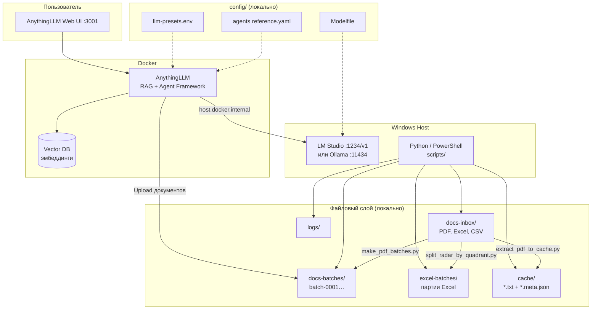
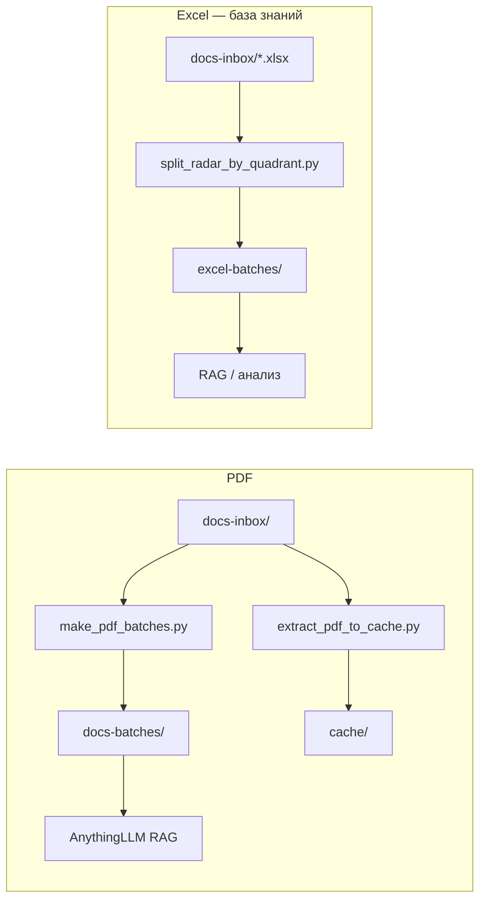

# TR Agent

Локальная система исследования документов и бизнес-данных: файловый конвейер PDF/Excel + RAG через **AnythingLLM** и локальные LLM (**Ollama** / **LM Studio**).

**Документация:** [docs/PRD.md](docs/PRD.md)

---

## Архитектура проекта



### Конвейеры данных



---

## Быстрый старт

```powershell
cd "C:\AI Agent\TR Agent"

# Диагностика окружения
.\scripts\check_environment.ps1

# PDF → батчи по 100
python .\scripts\make_pdf_batches.py

# PDF → текст в cache
python .\scripts\extract_pdf_to_cache.py --all --skip-existing

# Excel → партии базы знаний
python .\scripts\split_radar_by_quadrant.py
```

---

## Структура репозитория

| Путь | Назначение | Git |
|------|------------|-----|
| `docs/` | PRD и документация | ✅ |
| `scripts/` | Утилиты подготовки данных | ✅ |
| `docs-inbox/` | Исходные PDF, Excel, CSV | ❌ |
| `docs-batches/` | PDF-партии | ❌ |
| `cache/`, `logs/`, `config/`, `notes/` | Рабочие данные и настройки | ❌ |
