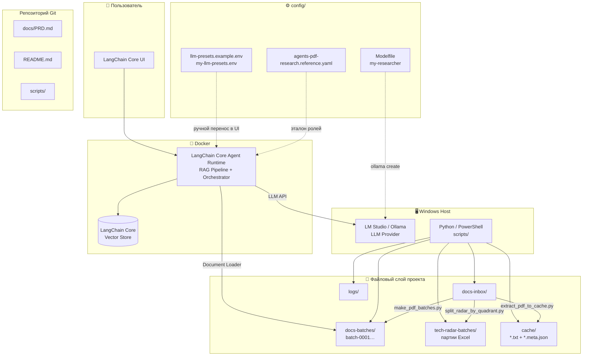
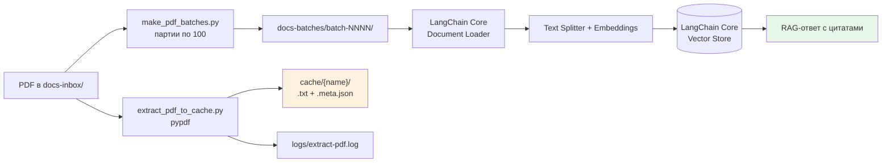
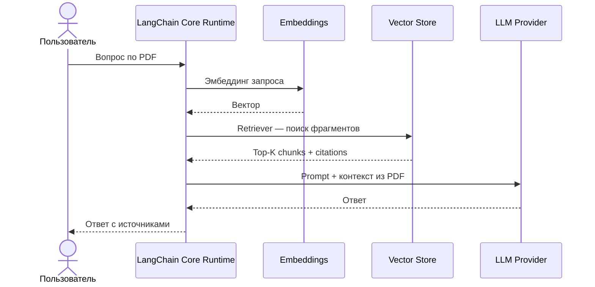
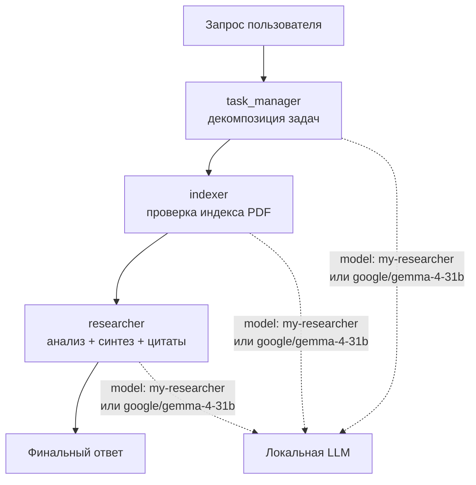
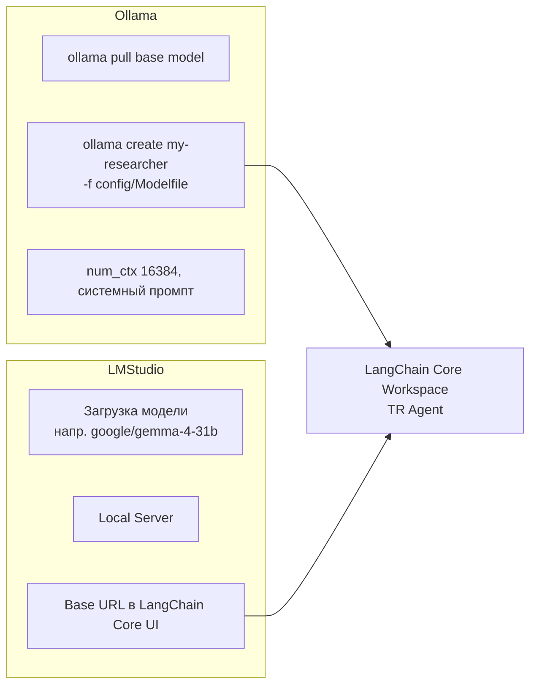

# PRD: TR Agent

**Product Requirements Document**

| Поле | Значение |
|------|----------|
| Продукт | TR Agent |
| Версия документа | 1.0.3 |
| Дата | 2026-06-14 |
| Репозиторий | [github.com/Boldurev16/TR-Agent](https://github.com/Boldurev16/TR-Agent) |
| Статус | В разработке (MVP / пилот) |

---

## 1. Обзор продукта

**TR Agent** — локальная система исследования документов и бизнес-данных. Продукт объединяет:

- файловый конвейер подготовки PDF и Excel;
- **LangChain Core RAG Pipeline** для семантического поиска и ответов с цитатами;
- локальные LLM (**Ollama** и/или **LM Studio**) без отправки данных во внешние облака;
- модуль работы с базой знаний на базе Excel-файлов (разбиение, партии, подготовка к RAG).

Проект предназначен для работы с **PDF-материалами**, **Excel-источниками** и **структурированными бизнес-данными** в локальном контуре.

---

## 2. Цели проекта

### 2.1. Бизнес-цели

| # | Цель | Критерий успеха |
|---|------|-----------------|
| G1 | Быстрый поиск ответов по большому массиву PDF и Excel | Ответ с цитатами из документа за ≤ 30 с на пилотной выборке |
| G2 | Локальная обработка конфиденциальных материалов | Данные не покидают ПК / локальный Docker |
| G3 | Масштабирование до тысяч документов | Конвейер батчей (100 PDF) + кэш текста без повторной обработки |
| G4 | Структурирование бизнес-данных из файлов-источников | PDF и Excel разбиты на управляемые партии, готовые к RAG и анализу |

### 2.2. Технические цели

- Единая диагностика окружения перед каждым экспериментом (`check_environment.ps1`).
- Воспроизводимая конфигурация LLM (пресеты в `config/`, не в Git).
- Разделение: код и документация в Git; рабочие документы, кэш и секреты — локально.
- Поэтапное наращивание: диагностика → батчи → RAG → массовое извлечение текста → база знаний Excel.

### 2.3. Нецели (out of scope на текущем этапе)

- Облачный SaaS-деплой и multi-user доступ.
- Полноценный OCR для сканов без текстового слоя (запланировано отдельно).
- Автоматический импорт YAML агентов в LangChain Core Agent Orchestrator (только эталон для ручной настройки).

---

## 3. Пользователи и сценарии

### 3.1. Персоны

| Персона | Задача |
|---------|--------|
| **Аналитик / исследователь** | Задаёт вопросы по PDF и Excel-источникам, получает ответы с источниками |
| **Оператор конвейера** | Кладёт файлы в `docs-inbox`, запускает скрипты подготовки и кэширования |
| **Администратор LLM** | Настраивает LangChain Core Runtime, LM Studio/Ollama, эмбеддинги, workspace «TR Agent» |

### 3.2. Ключевые user stories

1. **US-1.** Как аналитик, я хочу загрузить PDF в LangChain Core Document Loader и задать вопрос по содержимому, чтобы получить ответ с указанием источника.
2. **US-2.** Как оператор, я хочу разбить тысячи PDF на партии по 100 файлов, чтобы загружать их в RAG поэтапно.
3. **US-3.** Как оператор, я хочу извлечь текст PDF в `cache/` с логированием, чтобы не зависеть только от LangChain Core UI.
4. **US-4.** Как аналитик, я хочу разбить большие Excel-файлы на партии, чтобы обрабатывать базу знаний порциями и загружать в RAG.
5. **US-5.** Как администратор, я хочу одной командой проверить Ollama, Docker, LangChain Core Runtime и LM Studio, чтобы быстро локализовать сбои.

---

## 4. Функциональные требования

### 4.1. Модуль диагностики окружения

**Скрипт:** `scripts/check_environment.ps1`

| ID | Требование | Статус |
|----|------------|--------|
| F-ENV-01 | Проверка наличия и доступности Ollama | ✅ |
| F-ENV-02 | Проверка Docker daemon | ✅ |
| F-ENV-03 | Проверка LangChain Core Agent Runtime | ✅ |
| F-ENV-04 | Проверка LM Studio OpenAI API и списка моделей | ✅ |
| F-ENV-05 | Отчёт по RAM, диску, GPU | ✅ |
| F-ENV-06 | Проверка обязательных папок проекта | ✅ |

### 4.2. Модуль подготовки PDF

**Скрипт:** `scripts/make_pdf_batches.py`

| ID | Требование | Статус |
|----|------------|--------|
| F-PDF-01 | Чтение `*.pdf` из `docs-inbox/` | ✅ |
| F-PDF-02 | Сортировка по дате изменения (новые первыми) | ✅ |
| F-PDF-03 | Копирование в `docs-batches/batch-NNNN/` по 100 файлов | ✅ |
| F-PDF-04 | Пропуск уже существующих копий | ✅ |

### 4.3. Модуль извлечения текста (кэш)

**Скрипт:** `scripts/extract_pdf_to_cache.py`

| ID | Требование | Статус |
|----|------------|--------|
| F-CACHE-01 | Извлечение текста через `pypdf` | ✅ |
| F-CACHE-02 | Запись `{stem}.txt` и `{stem}.meta.json` в `cache/{stem}/` | ✅ |
| F-CACHE-03 | Режимы: один файл, последний в inbox, `--all`, `--skip-existing` | ✅ |
| F-CACHE-04 | Логирование в `logs/extract-pdf.log` | ✅ |
| F-CACHE-05 | Предупреждение при пустом тексте (image-only PDF) | ✅ |
| F-CACHE-06 | OCR / `unstructured` для сканов | 🔲 Запланировано |

### 4.4. Модуль работы с базой знаний на базе Excel-файлов

**Скрипт:** `scripts/split_radar_by_quadrant.py` (первый обработчик; модуль расширяем под другие Excel-источники)

| ID | Требование | Статус |
|----|------------|--------|
| F-KB-01 | Чтение исходных Excel из `docs-inbox/` | ✅ |
| F-KB-02 | Разбиение больших таблиц на управляемые партии (по 20 строк) | ✅ |
| F-KB-03 | Группировка записей по бизнес-разделам (категории / квадранты) | ✅ |
| F-KB-04 | Экспорт партий в `docs-inbox/tech-radar-batches/` для RAG и анализа | ✅ |
| F-KB-05 | Пути относительно корня проекта | ✅ |
| F-KB-06 | Универсальный импорт произвольных Excel-источников | 🔲 Запланировано |

### 4.5. RAG и чат (LangChain Core)

| ID | Требование | Статус |
|----|------------|--------|
| F-RAG-01 | Воркспейс «TR Agent» с локальной chat-моделью | 🔲 Настраивается вручную |
| F-RAG-02 | Модель эмбеддингов для векторного индекса | 🔲 Настраивается вручную |
| F-RAG-03 | Загрузка PDF из `docs-batches/` и индексация | 🔲 Пилот |
| F-RAG-04 | Ответы с citations / источниками | 🔲 Пилот |
| F-RAG-05 | Multi-agent workflow (task_manager → indexer → researcher) | 🔲 Эталон в `config/agents-pdf-research.reference.yaml` |

---

## 5. Архитектура системы

**TR Agent** — локальная система обработки PDF и Excel-источников через RAG: файлы попадают в файловый конвейер, LangChain Core RAG Pipeline индексирует документы, локальная LLM отвечает по контексту.

Архитектурный стиль: **локальный pipeline + RAG-микросервис** — подготовка данных скриптами, интеллектуальный слой в Docker, конфигурация и рабочие файлы локально вне Git.

---

### 5.1. Дерево каталогов

```
TR Agent/
├── docs/                    ← документация проекта (в Git)
│   └── PRD.md
├── docs-inbox/              ← входящие PDF, XLSX, CSV (локально)
│   ├── 22.05.2026/          ← бизнес-материалы, аналитика, исходные файлы
│   └── tech-radar-batches/  ← партии Excel базы знаний (генерируются скриптом)
├── docs-batches/            ← PDF партиями по 100 (batch-0001, …)
├── cache/                   ← извлечённый текст + метаданные
├── logs/                    ← журналы (extract-pdf.log)
├── scripts/                 ← Python + PowerShell утилиты (в Git)
├── config/                  ← LLM-пресеты, Modelfile, эталон агентов (локально)
├── notes/                   ← рабочие заметки (локально)
└── requirements.txt
```

| Каталог | Назначение | Git |
|---------|------------|-----|
| `docs-inbox/` | Исходные PDF, Excel, CSV | ❌ |
| `docs-batches/` | Копии PDF партиями (`batch-0001`, …) | ❌ |
| `scripts/` | Диагностика и вспомогательные скрипты | ✅ |
| `config/` | `llm-presets.example.env`, `Modelfile`, `agents-pdf-research.reference.yaml` | ❌ |
| `cache/` | Извлечённый текст (`*.txt`, `*.meta.json`) | ❌ |
| `logs/` | Журналы обработки и ошибок | ❌ |
| `notes/` | Этапы работы и заметки | ❌ |
| `docs/` | PRD и проектная документация | ✅ |

---

### 5.2. Общая схема (три уровня)



**Потоки данных:**

1. **Оператор → скрипты:** PDF и Excel кладутся в `docs-inbox/`, скрипты готовят батчи, кэш и партии базы знаний.
2. **Оператор → LangChain Core:** PDF из `docs-batches/` загружаются в workspace «TR Agent» через Document Loader.
3. **LangChain Core → LLM:** запросы чата и эмбеддингов уходят на LLM Provider на хосте через сеть Docker.
4. **Config → UI:** пресеты LLM переносятся в LangChain Core UI вручную (не через Git).

---

### 5.3. Конвейер обработки PDF



| Этап | Скрипт | Назначение |
|------|--------|------------|
| Диагностика | `check_environment.ps1` | Ollama, Docker, LangChain Core Runtime, LM Studio, RAM/GPU, наличие папок |
| Батчинг | `make_pdf_batches.py` | Копирование PDF в `docs-batches/` по 100 шт., сортировка по дате (новые первыми) |
| Кэш текста | `extract_pdf_to_cache.py` | Извлечение текста через `pypdf` → `cache/`; флаги `--all`, `--skip-existing` |
| База знаний Excel | `split_radar_by_quadrant.py` | Разбиение Excel-источников на партии по категориям → `tech-radar-batches/` |

**Конвейер Excel (база знаний):**


---

### 5.4. Цепочка запроса в чате (RAG)

LangChain Core **не читает PDF с диска напрямую**. Chat-модель видит только то, что попало в промпт после индексации.

**Схема RAG:**

1. PDF загружают в workspace → LangChain Core **Document Loader** извлекает текст, **Text Splitter** режет на фрагменты.
2. **Embeddings** строят **LangChain Core Vector Store** (отдельная модель эмбеддингов).
3. **Retriever** подмешивает релевантные фрагменты в промпт.
4. **LLM Chain** формулирует ответ по контексту с citations.



**Критерий успеха RAG:** в ответе появляются факты из файла; в UI видны **источники** / citations. Если модель «рассуждает вообще» без цитат — контекст из PDF не подмешался (проверить индексацию и эмбеддинги).

---

### 5.5. Multi-agent (логическая модель)

Файл `config/agents-pdf-research.reference.yaml` описывает три роли. Импорт YAML в LangChain Core Agent Orchestrator обычно недоступен — это **эталон для ручной настройки** workspace «TR Agent».



| Агент | Роль | Capabilities |
|-------|------|--------------|
| `task_manager` | Разбивает сложные запросы на подзадачи | `task_decomposition`, `priority_assignment` |
| `indexer` | Управляет индексацией и обработкой PDF | `pdf_processing`, `incremental_indexing`, `error_handling` |
| `researcher` | Анализирует документы и синтезирует ответы | `deep_analysis`, `cross_document_synthesis`, `citation_extraction` |

**Workflow (эталон):**

1. `task_manager` получает запрос пользователя.
2. `task_manager` декомпозирует запрос на подзадачи.
3. `indexer` проверяет, проиндексированы ли нужные документы.
4. `researcher` анализирует релевантные документы.
5. Синтез и валидация финального ответа.

**Варианты внедрения в LangChain Core Agent Orchestrator:**

- три workspace с разным системным промптом под роль;
- один workspace с явными фазами в чате («Сначала разбей задачу… / Проверь индекс… / Ответь с цитатами…»);
- цепочки агентов (Agent Chains), если используются многошаговые сценарии.

---

### 5.6. Конфигурация LLM (два пути)



| Параметр | LM Studio | Ollama |
|----------|-----------|--------|
| Base URL | OpenAI-compatible endpoint LLM Provider | Native API Ollama |
| API Key | произвольная строка (если требуется провайдером) | не требуется / по версии |
| Model id | id из списка моделей провайдера (напр. `google/gemma-4-31b`) | `my-researcher` (кастом через Modelfile) |
| Переключение модели | загрузить модель в LM Studio **и** обновить id в LangChain Core UI | `ollama create` / смена модели в UI |

> **Важно:** LangChain Core Agent Runtime в Docker обращается к LLM Provider на Windows-хосте через сеть Docker, а не через loopback контейнера.

**Пресеты:** скопировать `config/llm-presets.example.env` → `config/my-llm-presets.env`, заполнить после прогона `check_environment.ps1`, переносить значения в UI вручную.

**Modelfile** (`config/Modelfile`): базовая модель, `num_ctx 16384`, системный промпт исследовательского агента с требованием указывать источник (документ, страница).

---

### 5.7. Дополнительные артефакты

| Файл / каталог | Роль в архитектуре |
|----------------|-------------------|
| `docs-inbox/22.05.2026/` | Исходные бизнес-файлы: PDF, CSV, DOCX, XLSX, HTML |
| `split_radar_by_quadrant.py` | Разбиение Excel-источников на партии базы знаний |
| `README.md` | Главная страница репозитория со схемой архитектуры |

---

### 5.8. Интеграции

| Компонент | Протокол | Назначение |
|-----------|----------|------------|
| LangChain Core Agent Runtime | HTTP | UI, RAG Pipeline, Agent Orchestrator |
| LangChain Core Vector Store | внутренний / API | Хранение эмбеддингов, Retriever |
| LM Studio | OpenAI-compatible REST | Chat-модель, Embeddings |
| Ollama | Native API | Альтернативный LLM Provider |
| Docker | — | Среда выполнения LangChain Core Runtime |

---

### 5.9. Текущее состояние реализации

**Реализовано:**

1. Каркас папок и документация (`README.md`, `docs/PRD.md`).
2. `scripts/check_environment.ps1` — Ollama, Docker, LangChain Core Runtime, LM Studio, RAM, диск, GPU, папки.
3. `scripts/make_pdf_batches.py` — батчи по 100 файлов, сортировка по дате изменения.
4. `scripts/extract_pdf_to_cache.py` — извлечение текста в `cache/` с логом.
5. `scripts/split_radar_by_quadrant.py` — партии Excel базы знаний.
6. `config/Modelfile`, `config/agents-pdf-research.reference.yaml` — эталоны (локально).
7. Git-репозиторий: [github.com/Boldurev16/TR-Agent](https://github.com/Boldurev16/TR-Agent).

**Запланировано:**

1. Полный стек Ollama/LM Studio + LangChain Core Agent Orchestrator.
2. Пилот на **100 PDF** → масштаб до 10 000.
3. OCR / `unstructured` для сканов без текстового слоя.
4. Расширение модуля Excel: универсальный импорт произвольных источников.

---

### 5.10. Зависимости архитектуры

```
requirements.txt
└── pypdf>=4.0,<6          # extract_pdf_to_cache.py

split_radar_by_quadrant.py
└── pandas, openpyxl       # пока не зафиксированы в requirements.txt
```

**Внешний стек (не в репозитории):** Docker, LangChain Core Runtime, Ollama и/или LM Studio, embedding-модель для Vector Store (например, `nomic-embed-text`).

---

### 5.11. Безопасность и границы данных

| Категория | Хранение | Git |
|-----------|----------|-----|
| Код и документация (`docs/`, `scripts/`, `README.md`) | Репозиторий | ✅ |
| `config/`, `*.env`, секреты | Локально | ❌ |
| PDF, Excel, батчи (`docs-inbox/`, `docs-batches/`) | Локально | ❌ |
| Кэш текста, логи (`cache/`, `logs/`) | Локально | ❌ |
| Личные заметки (`notes/`) | Локально | ❌ |

---

## 6. Нефункциональные требования

| ID | Требование | Значение |
|----|------------|----------|
| NF-01 | Рабочая ОС | Windows 10/11 |
| NF-02 | RAM (рекомендация) | ≥ 32 ГБ для крупных моделей |
| NF-03 | Python | 3.10+ |
| NF-04 | Конфиденциальность | Обработка локально, без обязательного облака |
| NF-05 | Повторяемость | Скрипты с путями от корня проекта |
| NF-06 | Наблюдаемость | Логи в `logs/`, диагностика через `check_environment.ps1` |

---

## 7. Зависимости

Подробная схема зависимостей — в [§5.10](#510-зависимости-архитектуры).

### 7.1. Python (`requirements.txt`)

| Пакет | Назначение |
|-------|------------|
| `pypdf>=4.0,<6` | Извлечение текста из PDF (`extract_pdf_to_cache.py`) |

Дополнительно для `split_radar_by_quadrant.py`: `pandas`, `openpyxl` (пока не зафиксированы в `requirements.txt`).

### 7.2. Внешний стек

| Компонент | Назначение |
|-----------|------------|
| Docker Desktop | Среда LangChain Core Agent Runtime |
| LangChain Core | RAG Pipeline, UI, Agent Orchestrator, Vector Store |
| LM Studio и/или Ollama | Локальные chat-модели |
| Embedding-модель | Векторный индекс (например, `nomic-embed-text`) |

---

## 8. Roadmap

| Этап | Содержание | Статус |
|------|------------|--------|
| **M0** | Каркас проекта, диагностика, батчи PDF | ✅ |
| **M1** | LangChain Core + локальная LLM, пилот RAG на 1–3 PDF | 🔲 |
| **M2** | Пилот 100 PDF, оценка качества citations | 🔲 |
| **M3** | Массовое извлечение в `cache/`, OCR для сканов | 🔲 |
| **M4** | Расширение модуля Excel-базы знаний, индексация партий в RAG | 🔲 |
| **M5** | Agent Orchestrator по эталону YAML | 🔲 |

---

## 9. Риски и ограничения

| Риск | Влияние | Митигация |
|------|---------|-----------|
| PDF без текстового слоя | Пустой `cache/`, бесполезный RAG | OCR / `unstructured`, предупреждение в логе |
| Несовпадение model id LLM Provider и LangChain Core UI | Ошибки или неверная модель | `check_environment.ps1`, пресеты в `config/` |
| Большой объём PDF | Нехватка RAM, медленная индексация | Батчи по 100, `--skip-existing` |
| LangChain Core UI ≠ YAML агентов | Ручная настройка ролей | Эталон + пошаговые фазы в чате |

---

## 10. Команды (quick reference)

```powershell
cd "C:\AI Agent\TR Agent"

# Диагностика
.\scripts\check_environment.ps1

# PDF → батчи
python .\scripts\make_pdf_batches.py

# PDF → cache
python .\scripts\extract_pdf_to_cache.py --all --skip-existing

# Excel → партии базы знаний
python .\scripts\split_radar_by_quadrant.py
```

---

## 11. Связанные документы

| Документ | Расположение | В Git |
|----------|--------------|-------|
| README (архитектура на главной) | `README.md` | ✅ |
| PRD | `docs/PRD.md` | ✅ |
| Эталон агентов | `config/agents-pdf-research.reference.yaml` | ❌ |

---

## 12. История изменений

| Версия | Дата | Изменения |
|--------|------|-----------|
| 1.0.3 | 2026-06-14 | AnythingLLM заменён на компоненты LangChain Core; убраны явные порты |
| 1.0.2 | 2026-06-14 | Убраны учебная база и нормализация ИТ-идей; модуль Excel-базы знаний; README со схемой для GitHub |
| 1.0.1 | 2026-06-14 | Раздел архитектуры расширен: дерево каталогов, 3 уровня, конвейеры, RAG, агенты, LLM |
| 1.0.0 | 2026-06-14 | Первая версия PRD: цели, функциональность, архитектура |
